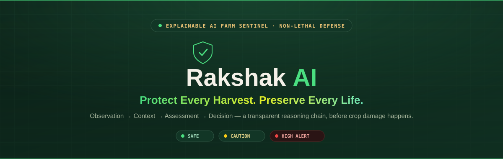

# 🌾 Rakshak AI
### **Protect Every Harvest. Preserve Every Life.**

<p align="center">
  
</p>

<p align="center">


</p>

---

# 🌱 Overview

**Rakshak AI** is an **AI-powered Farm Decision Support System (FDSS)** designed to help farmers **understand animal intrusions, assess their severity, and recommend the safest non-lethal response before crop damage occurs.**

Unlike conventional surveillance or alarm systems, Rakshak AI focuses on **decision support**, combining AI vision with contextual reasoning to generate transparent and explainable recommendations.

> **Detection tells farmers what happened.**
>
> **Rakshak AI helps them decide what to do next.**

---

# 🎯 Problem Statement

Every year, thousands of farmers lose significant portions of their harvest due to unexpected wildlife intrusion.

Existing solutions usually provide:

- CCTV monitoring
- Motion alarms
- Animal detection

These systems still leave the farmer with the hardest question:

> **"What should I do now?"**

Rakshak AI answers that question.

---

# 💡 Our Solution

Rakshak AI observes the environment, understands the context, evaluates the situation, and recommends the safest action while keeping the farmer in complete control.

The product follows a human-like reasoning pipeline:

```text
Observation
      │
      ▼
Context Understanding
      │
      ▼
Situation Assessment
      │
      ▼
Decision Support
      │
      ▼
Incident Timeline
```

---

# ✨ Key Features

## 👀 AI Vision Module

- Animal Detection
- Multi-object Tracking
- Movement Direction Estimation
- Continuous Observation
- Real-time Video Processing

---

# 🌾 Field Context Module

The system understands the environment before making recommendations.

Context includes:

- Protected Crop Region
- Object Position
- Distance from Crop
- Movement Direction
- Time of Day

No GPS.

No satellite imagery.

No expensive infrastructure.

Only practical deployment.

---

# 🧠 Explainable Decision Engine (EDE)

The heart of Rakshak AI.

Instead of simply detecting animals, the Explainable Decision Engine combines:

- AI observations
- Environmental context
- Temporal information
- Spatial reasoning

to generate:

- Threat Level
- Recommended Response
- Human-readable Explanation

Every recommendation includes **why** it was generated.

---

# 🚨 Smart Response Engine

Maps threat levels into non-lethal deterrent recommendations.

Example:

| Threat Level | Recommendation |
|--------------|---------------|
| LOW | Monitor Only |
| MEDIUM | Prepare Response |
| HIGH | Flash Light + Speaker |

The farmer always has the option to:

- Accept Recommendation
- Ignore Recommendation
- Take Manual Action

---

# 📜 Incident Timeline

Every important event is stored.

Each incident records:

- Timestamp
- Animal Species
- Detection Confidence
- Threat Level
- Recommended Response
- Final Outcome

Useful for:

- Replay
- Review
- Farm Reports
- Future Improvements

---

# ⭐ What Makes Rakshak AI Different?

Most solutions:

```text
Animal Detection
        │
        ▼
Alarm
```

Rakshak AI:

```text
Observation
      │
      ▼
Context Understanding
      │
      ▼
Situation Assessment
      │
      ▼
Decision Support
      │
      ▼
Incident Timeline
```

We don't automate decisions.

We improve decisions.

---

# 🏗️ System Architecture

```text
                 Camera Feed
                      │
                      ▼
             AI Vision Module
      Detection + Tracking + Position
                      │
                      ▼
            Field Context Module
      Crop Region + Distance + Time
                      │
                      ▼
      Explainable Decision Engine
      Threat Assessment + Reasoning
                      │
                      ▼
         Smart Response Engine
                      │
                      ▼
        Farmer Recommendation
                      │
                      ▼
         Incident Timeline Log
```

---

# 🧠 Explainable Decision Engine

## Inputs

### Observation

- Animal Species
- Detection Confidence
- Current Position
- Previous Position

### Context

- Protected Crop Region
- Distance to Crop
- Movement Direction
- Time of Day

---

## Decision Pipeline

```text
Observation
      │
      ▼
Context Understanding
      │
      ▼
Situation Assessment
      │
      ▼
Threat Assessment
      │
      ▼
Recommendation
      │
      ▼
Explanation
```

---

## Example Decision

### Observation

```
Animal Detected

Species:
Cow

Confidence:
92%
```

### Context

```
Protected Region:
Entered

Movement:
Toward Crop

Time:
Night
```

### Assessment

```
Threat Level

HIGH
```

### Recommendation

```
Flash Light + Speaker
```

### Explanation

```
Large animal has entered the protected crop region
during nighttime and is moving toward the crop,
indicating a high risk of crop damage.
```

---

# 📈 Threat Assessment

Detection Confidence and Threat Level are different concepts.

## Detection Confidence

Measures

> **How certain is the AI model that the object was detected correctly?**

---

## Threat Level

Measures

> **How dangerous is the current situation for the crop?**

These values are never mixed.

---

# 🛡 False Alarm Strategy

Rakshak AI follows a conservative policy.

| Situation | Action |
|-----------|--------|
| Bird | Monitor |
| Dog | Monitor |
| Human | Log Only |
| Unknown Object | Continue Tracking |
| Low Confidence Detection | No Alert |
| Cow Near Crop | High Threat Recommendation |

Low-confidence observations never become High Threat automatically.

---

# 🌿 Product Philosophy

Every engineering decision follows these principles.

## 🌾 Farmer First

Reduce complexity for farmers.

---

## 🔍 Explainable AI

Every recommendation includes a reason.

---

## 🕊 Wildlife Friendly

Promote non-lethal crop protection.

---

## ⚙ Reliable

Stability over unnecessary features.

---

## 🚀 Deployment Ready

Prototype today.

Edge deployment tomorrow.

---

# 🛠 Technology Stack

| Category | Technology |
|----------|------------|
| Language | Python |
| Computer Vision | OpenCV |
| AI Detection | YOLO |
| Tracking | ByteTrack / DeepSORT *(planned)* |
| Machine Learning | PyTorch |
| UI | Streamlit *(or chosen frontend)* |
| Visualization | Matplotlib |
| Data Handling | NumPy, Pandas |
| Version Control | Git |
| Repository | GitHub |

---

# 📂 Project Structure

```text
Rakshak-AI/
│
├── assets/
│   ├── rakshak-ai-banner.svg
│   └── screenshots/
│
├── data/
│
├── models/
│
├── src/
│   ├── vision/
│   ├── context/
│   ├── decision_engine/
│   ├── response_engine/
│   ├── timeline/
│   └── utils/
│
├── app.py
├── requirements.txt
├── README.md
└── LICENSE
```

---

# 🚀 Getting Started

## Clone Repository

```bash
git clone https://github.com/yourusername/Rakshak-AI.git
```

```bash
cd Rakshak-AI
```

---

## Create Virtual Environment

```bash
python -m venv venv
```

Windows

```bash
venv\Scripts\activate
```

Linux/macOS

```bash
source venv/bin/activate
```

---

## Install Dependencies

```bash
pip install -r requirements.txt
```

---

## Run

```bash
python app.py
```

---

# 📊 Demo Flow

```text
Peaceful Farm

        │

Animal Enters

        │

AI Detects Animal

        │

Tracks Movement

        │

Evaluates Context

        │

Threat Assessment

        │

Recommendation Generated

        │

Farmer Decision

        │

Incident Logged
```

---

# 📸 Screenshots

> Add screenshots inside `assets/screenshots`

```
Dashboard

AI Detection

Decision Explanation

Threat Assessment

Incident Timeline
```

---

# 🎯 Success Metrics

Rakshak AI aims to improve:

- Early Intrusion Awareness
- Faster Decision Making
- Better Decision Confidence
- Reduced False Alerts
- Lower Crop Damage Risk

---

# 🔮 Future Scope

- Edge AI Deployment
- Thermal Camera Integration
- Solar-powered Field Unit
- Mobile Application
- Offline Inference
- SMS Alerts
- IoT Sensor Integration
- Farm Analytics Dashboard
- Multi-language Support
- Federated Learning
- Adaptive Threat Scoring

---

# 🤝 Contributing

Contributions are welcome!

1. Fork the repository.
2. Create a new branch.
3. Commit your changes.
4. Open a Pull Request.

---

# 📜 License

This project is licensed under the MIT License.

---

# 👥 Team

**Rakshak AI**

An AI-powered initiative dedicated to building trustworthy and explainable decision-support systems for sustainable agriculture.

---

# ❤️ Our Vision

> **Helping farmers make the right decision before crop damage occurs.**

Technology alone doesn't protect crops.

**Better decisions do.**

---

<p align="center">

### 🌾 Protect Every Harvest • Preserve Every Life

**Built with ❤️ for Farmers**

</p>
